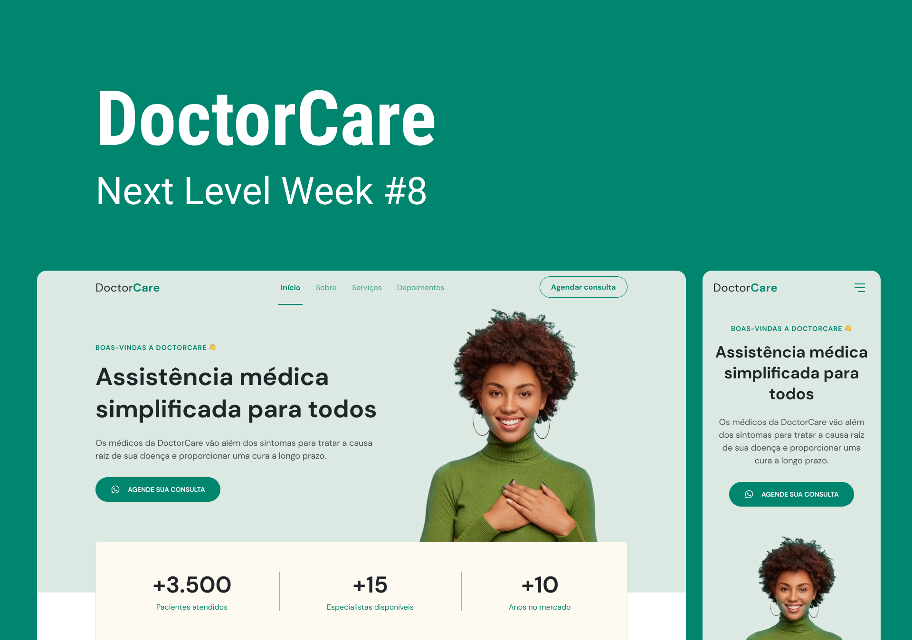
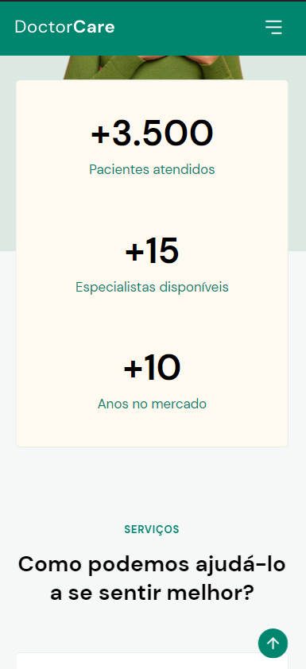
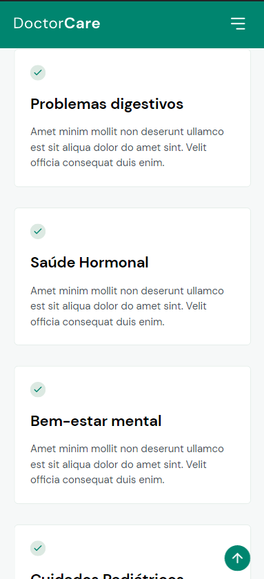
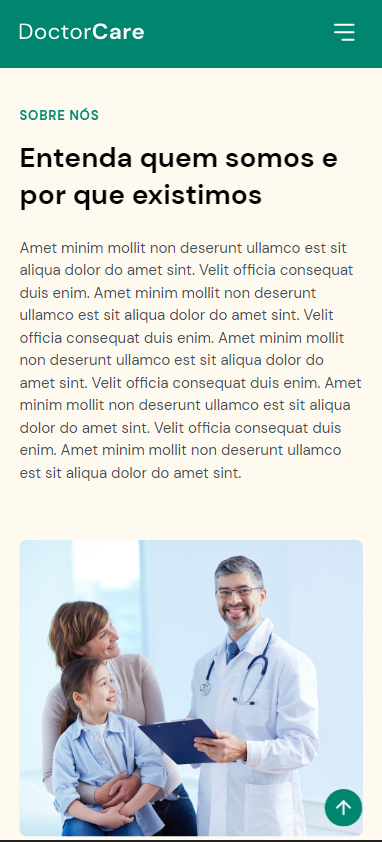

<h1 align="center">
    
</h1>

<h1 align="center">
    <a href="#"> DoctorCare </a>
</h1>

<h3 align="center">  Simplified medical care for everyone
</h3>

  
	
  
    
  
  

  
	
  
  

<h4 align="center"> 
	 Status: Finished
</h4>

 <a href="#-about">About</a> •
 <a href="#-Features">Features</a> •
 <a href="#-layout">Layout</a> • 
 <a href="#-tech-stack">Tech Stack</a> • 
 <a href="#-author">Author</a> • 
 <a href="#-license">License</a>

## 💻 About

Doctor Care is a simplified healthcare landing page.

Project developed during ** NLW - Next Level Week ** offered by [Rocketseat](https://lp.rocketseat.com.br/nlw-return). NLW is an online experience with lots of practical content, challenges and hacks where the content is available for a week.

---

## ⚙️ Features

- [x] The main part consists of the following information:
   - [x] number of patients seen
   - [x] number of specialists available
   - [x] total number of years on the market

- [x] Soon after comes a section with the services that are available:
- [x] The next section contains information about the company
- [x] And finally, there's a section to contact support.

---

## 🎨 Layout

The application layout is available on Figma:

### Web

  

### Mobile

  
  
  
  
  
  
  
  
  

---

## 🛠 Tech Stack

The following tools were used in the construction of the project:

#### **Website** 

-   HTML
-   CSS
-   Javascript

---
## 🦸 Author

<a href="https://blog.rocketseat.com.br/author/exodo/">
  
  
 <b>Êxodo Gurgel</b></a>  🚀
  

 

---

## 📝 License

This project is under the license [MIT](./LICENSE).

Made with ❤️ by Êxodo Gurgel 👋🏽 [Get in Touch!](Https://www.linkedin.com/in/exodo-gurgel/)

---
